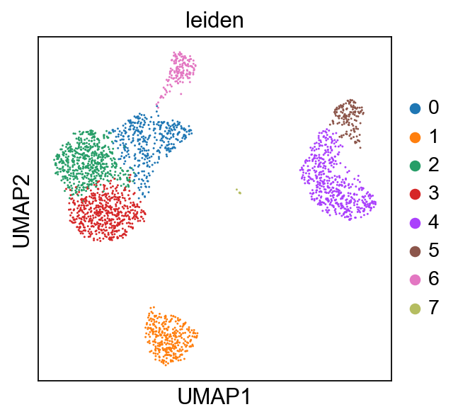
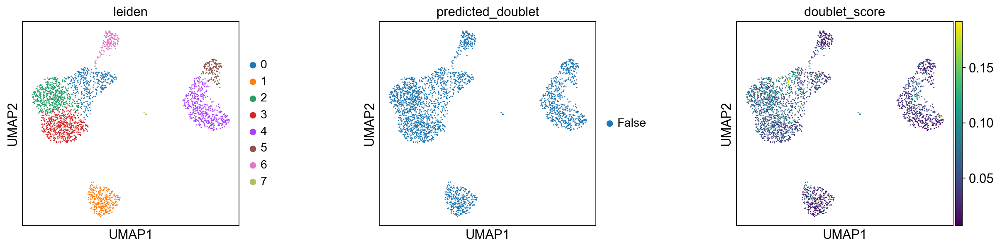
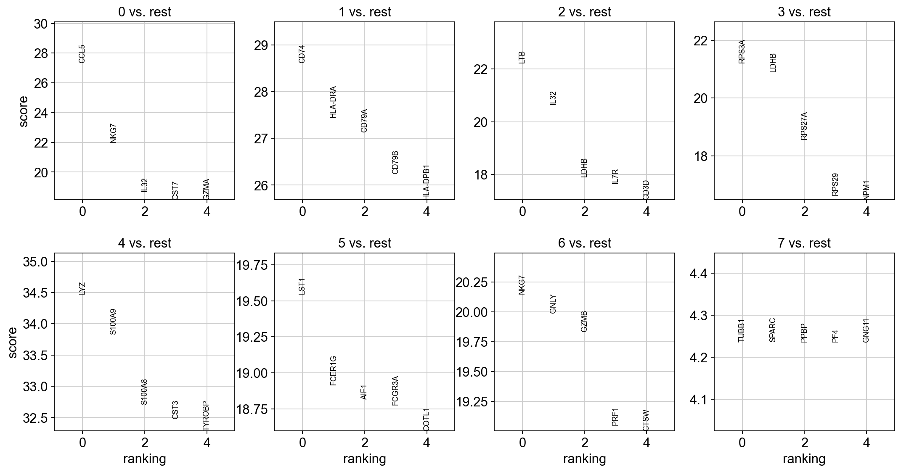
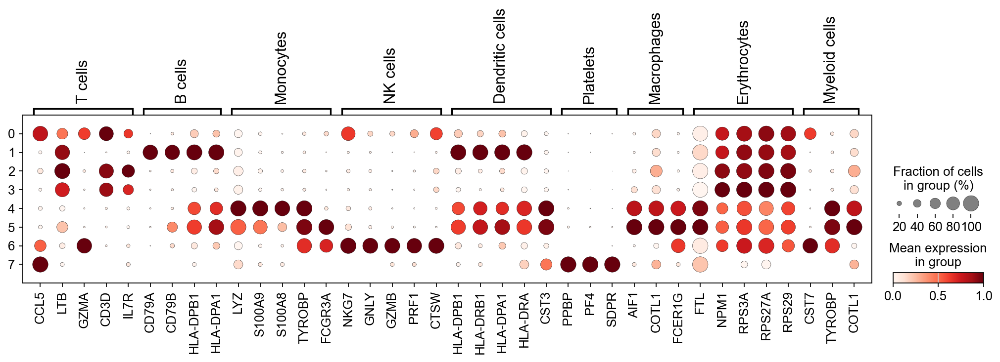
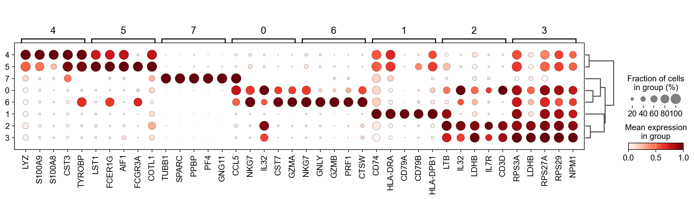
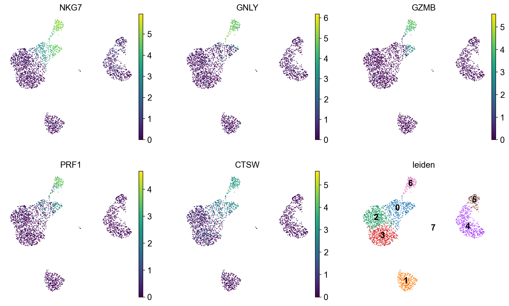

# Single Cell Integration Pipeline Demo

This repository is a beginner-friendly demonstration of a **Single Cell Integration Pipeline**, primarily following the **Scanpy** tutorials.

## Table of Contents
- [Load the Data](#1-load-the-data)
- [Quality Control](#2-quality-control)
- [Normalization and Log Transformation](#3-normalization-and-log-transformation)
- [Feature Selection](#4-feature-selection)
- [Dimensionality Reduction](#5-dimensionality-reduction)
- [Clustering](#6-clustering)
- [Marker Gene and Annotation](#7-marker-gene-and-annotation)


### 1. Load the Data

PBMC 3k (peripheral blood mononuclear cell) is a small-scale dataset (2700 cells) from 10X Genomics.

Single-cell data is stored in **AnnData**, which includes cells(obs), genes(var), and the Count matrix (X).

> `X` is the Count matrix, where rows correspond to cells (`n_obs`), and columns correspond to genes (`n_vars`). 

> `obs`: stores metadata about cells (e.g., cell type, sample origin, etc.).

> `var`: stores metadata about genes (e.g., gene IDs, gene names, etc.).

> `Count`: The amount of RNA detected for each gene in a cell.


### 2. Quality Control

The goal for quality control is to remove low-quality cells from the dataset. A cell with a low number of detected genes, a low count depth, and a high fraction of mitochondrial counts might have a broken membrane, which can indicate a dying cell.

#### 2.1. Identifying some important genes

During single-cell RNA-seq (scRNA-seq) quality control (QC), we usually check the expression ratio of mitochondrial genes (MT-genes).
  - Mitochondrial genes are primarily involved in cellular energy metabolism and should only account for a small portion of transcripts. If a cell has an abnormally high proportion of MT-gene expression, it often indicates that the cell is under stress, undergoing apoptosis, or has lysed.
  - When a cell dies, its membrane may rupture, leading to RNA leakage. However, mitochondrial RNA is more stable and less prone to degradation, so scRNA-seq results for dead cells often show an abnormally high proportion of MT-gene expression.

```bash
adata.var["mt"] = adata.var_names.str.starts with("MT-")
```

When cells die or respond to stress, the proportion of mitochondrial gene expression increases.

> Usually, we will also check Ribosomal genes (ribo) and Hemoglobin genes (hb). It is not necessary for this dataset.

#### 2.2. Calculate QC metrics

`scanpy.pp.calculate_qc_metrics` is a quality control (QC) calculation function provided by `Scanpy`. It can compute multiple QC metrics at once and also calculate the count proportion of specific gene groups.

```bash
sc.pp.calculate_qc_metrics(
    adata, qc_vars=["mt"], inplace=True, log1p=True)
```

Some important metrics:

- `n_genes_by_counts`: the number of genes expressed in a cell.
- `total_counts`: the total number of counts (UMI) for a cell.
- `pct_counts_mt`: the percentage of counts in mitochondrial genes.

#### 2.3 Visualizing QC Metrics

Use `violin plots` to visualize the data distribution.

```bash
sc.pl.violin(
    adata,
    ["total_counts", "n_genes_by_counts", "pct_counts_mt"],
    jitter=0.4,
    multi_panel=True,
)
```


#### 2.3.1 `total_counts` distribution


#### 2.3.2 `n_genes_by_counts` distribution


#### 2.3.3 Scatter Plot and distribution for `pct_counts_mt`


#### 2.4 Detection and Remove Doublet

Doublets are defined as two cells sequenced under the same cellular barcode, for example, if they were captured in the same droplet. 

A doublet is called homotypic if it is formed by the same cell type (but from different individuals) and heterotypic otherwise. It is important to identify the heterotypic because they are most likely misclassified and can lead to error downstream analysis.

```bash
sc.pp.scrublet(adata)
adata = adata[adata.obs["doublet_score"] < 0.2, :]
```

In `scrublet` doublet detection, `doublet_score` represents the probability that a cell is a doublet (range: 0-1). 

If `doublet_score > 0.2`, the cell is likely a doublet.

We can determine appropriate filtering thresholds once we get those plots and doublet_score.

- `total_counts`:
  - Low total UMI counts may indicate low-quality cells, while very high counts suggest doublets.
  - Filtering: `total_counts < 650` and `total_counts > 5500`.
- n_genes_by_counts`:
  - Cells with low gene counts may be of poor quality, and extremely high values may indicate doublets.
  - Filtering: `n_genes_by_counts < 310` and `n_genes_by_counts > 1700`.
- `pct_counts_mt`:
  - High mitochondrial gene fractions may indicate dying cells.
  - Filtering: `pct_counts_mt > 7%`.
- `doublet`:
  - Filtering: `doublet_score < 0.2`.

### 3. Normalization and Log Transformation

#### Normalization
- Adjusts gene expression levels (counts) across cells to make them comparable.
- It can avoid technical noise and ensures consistent sequencing depth across different cells.
- I am using the default scanty method `noralize_total,` which is total counts Scaling.
  - Normalize the total UMI counts for each cell to a common target value (default target_sum = 1e4).
- Does not change the data distribution

#### Log Transformation (Log1p): 
- Reduce the influence of highly expressed genes, making the data distribution closer to a normal distribution, which is beneficial for PCA, UMAP, and clustering analysis.
- Does not change the relative expression relationships between different cells but compresses the dynamic range of the data.
- log1p is log(1+ $X_normalized$)

```bash
sc.pp.normalize_total(adata_filtered, target_sum=1e4)
sc.pp.log1p(adata_filtered)
```


- Left plot (raw count):
  - Right-skewed Distribution
  - Some cells have much higher RNA counts than others.
- Middle plot (After normalization):
  - Data points have formed several peaks instead of a continuous distribution.
  - Since all cells' total_counts are scaled to 10,000, the original data's continuity is disrupted. If some cells had similar total_counts before normalization, they converge to similar values after normalization, forming artificial peaks.
- Right plot (After log transformation):
  - The distribution is more symmetrical and close to the normal distribution.
  - Reduce outliers.

### 4. Feature Selection

Reduce the dimensionality of the dataset and only include the most informative genes.

- Select Highly Variable Genes (HVGs) to retain biological signals and reduce computational complexity.
- Improves clustering and dimensionality reduction effectiveness.


```bash
sc.pp.highly_variable_genes(adata, flavor="seurat_v3", n_top_genes=2000)
```


- Low mean expressions, low variances. --> NOT HVGs, usually is noise.
- High mean expressions, low variances. --> NOT HVGs, housekeeping genes, stable expression.
- HVGs: median/high mean expressions, high variances after normalization.

### 5. Dimensionality Reduction

Reduce data complexity, improve computational efficiency, and help with visualization.

#### PCA

Linear dimensionality reduction.

PCA identifies the principal components(PCs) of the data and projects high-dimensional data into a lower-dimensional space.

PCA creates a new set of uncorrelated variables, so-called principal components (PCs), via an orthogonal transformation of the original dataset. The PCs are linear combinations of features in the original dataset and are ranked in decreasing order of variance to define the transformation. Through the ranking usually the first PC amounts to the largest possible variance. PCs with the lowest variance are discarded to effectively reduce the dimensionality of the data without losing information.

Usually, 10-50 PCs are selected since the first few PCs explain most of the variance.

```bash
sc.tl.pca(adata_filtered) # defalut to 50 dimension 
sc.pl.pca_variance_ratio(adata_filtered, log=True)
```


- X-axis (ranking): Represents the ranking of principal components (PCs).
- Y-axis (variance ratio): A higher variance ratio means the PC captures more information from the data.
- The first few principal components contribute the most.
- After the first 10 PCs, the variance flattens out.

#### UMAP

Nonlinear dimensionality reduction for visualization.

We can compute `Neighborhood` and visualize it using UMAP.

```bash
sc.pp.neighbors(adata_filtered, n_pcs=15)
sc.tl.umap(adata_filtered)
sc.pl.umap(adata_filtered, color="total_counts", size=7)
```


- The X-axis (UMAP1) and Y-axis (UMAP2) represent the two dimensions of the UMAP projection (a 2D representation of data).
- Color bar: represents the total_counts. i.e., the total number of RNA molecules detected in each cell.
- Each dot represents a single cell.
- The position of each dot reflects its similarity to other cells based on gene expression.
- Cells are grouped into different clusters, often corresponding to different cell types
- It can re-assess quality control and detect doublets or batch effects.
  - Cells with abnormally high counts might be doublets or with extremely low total counts might be low-quality cells.
  - Some outliers at the edges might be low-quality cells.
  - If some clusters show distinct total counts, it may indicate batch effects in the data.


### 6. Clustering

1. The `Leiden algorithm` is commonly used for clustering single-cell data.

```bash
sc.tl.leiden(adata_filtered, flavor="igraph",
             n_iterations=2, resolution=0.5)
```

- `resolution=0.5` controls cluster granularity


2. Visualizing clusters with UMAP.

```bash
sc.pl.umap(adata_filtered, color=["leiden"], size=7)
```



- Cells with the same color are grouped together, indicating that they share similar gene expression patterns.
- Different colored clusters often represent different cell types (e.g., T cells, B cells, monocytes).

3. Try different `resolution` values.


- Higher resolution -> More clusters (smaller groups)
- Lower resolution -> Fewer clusters (larger groups).

4. Re-assess quality control

**Detect Doublets**


- Middle Plot: All dots are blue (False), meaning no obvious doublets were detected.
- Right Plot: Shows the doublet score for each cell, where brighter (yellow) colors indicate a higher probability of being a doublet.

**QC**


- `log1p_total_counts`: reflects total counts (total sequencing depth) per cell.
  - If some cells have very low total counts, they may be low-quality cells and should be filtered out.
- `pct_counts_mt`: shows the percentage of MT gene.
  - A high mitochondrial percentage may indicate cells under stress or dying cells.
- `log1p_n_genes_by_counts`: shows the number of detected genes per cell after log1p-transformed,  used to assess gene expression.
  - A low genes count -> might be low-quality cells or low-expression cell types.


### 7. Marker Gene and Annotation

#### 7.1 Top marker genes in each cluster

```bash
sc.tl.rank_genes_groups(adata, groupby="leiden", method="wilcoxon")
sc.pl.rank_genes_groups(adata, n_genes=5, sharey=False) # Top 5
```



- Each subplot represents a one-vs-rest comparison between a specific cell cluster and all other clusters.
- X-axis: Represents the `ranking` of genes based on their importance in defining the cluster.
- Y-axis: the marker `score`, which could be log-fold change (LFC), AUROC score, or Z-score.
- Gene names are displayed to indicate their significance in the given cluster and each cluster may represent a different cell type.
  - For example: `NKG7`、`GNLY`、 are the marker genes in cluster 6. Which means cluster 6 might be `NK Cells`.

#### 7.2 Create Marker Gene Dictionary

We can define a set of marker genes for the main cell types that we expect to see in this dataset. Then we can label our coarsest clustering with broad lineages.



#### 7.3 Differentially-expressed Genes as Markers

We can also calculate marker genes per cluster and then look up whether we can link those marker genes to any known biology.

Visualize the top 5 differentially expressed genes on a dot plot.



We can then choose the cell types we are interested in and create our own plot by extracting the differentially expressed genes for different clusters.



- This is the top 5 marker gene for cluster 6. 
